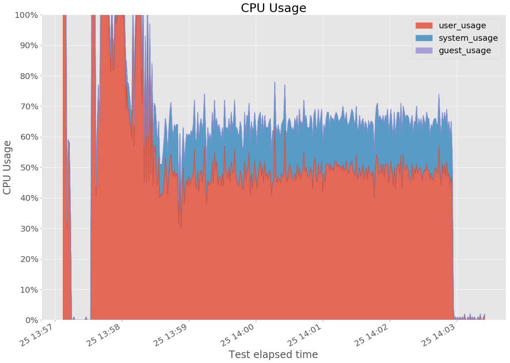
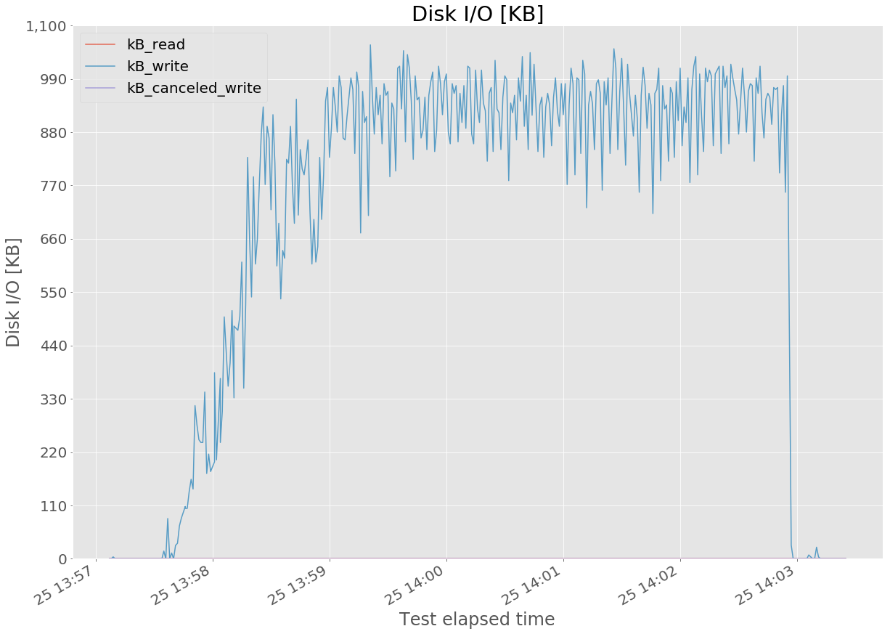
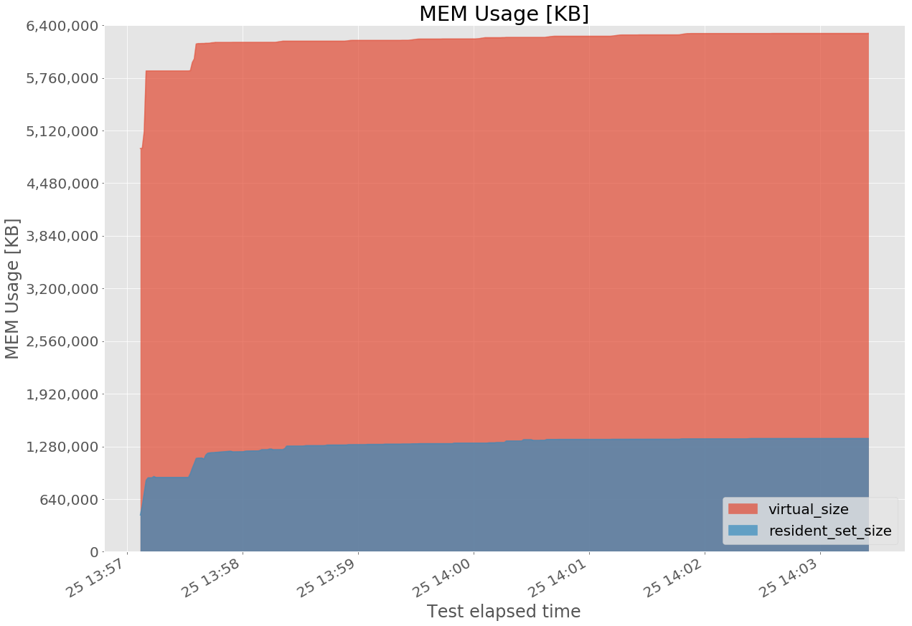
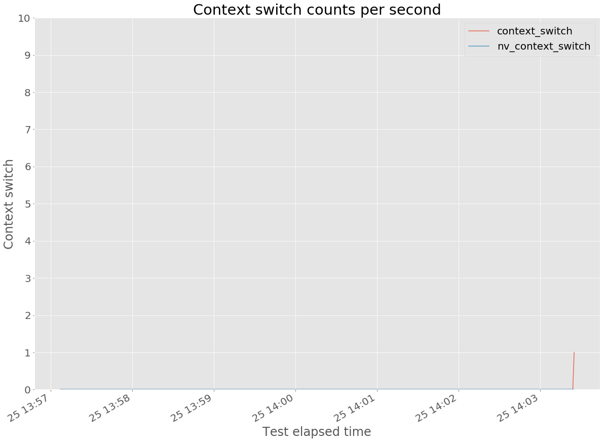
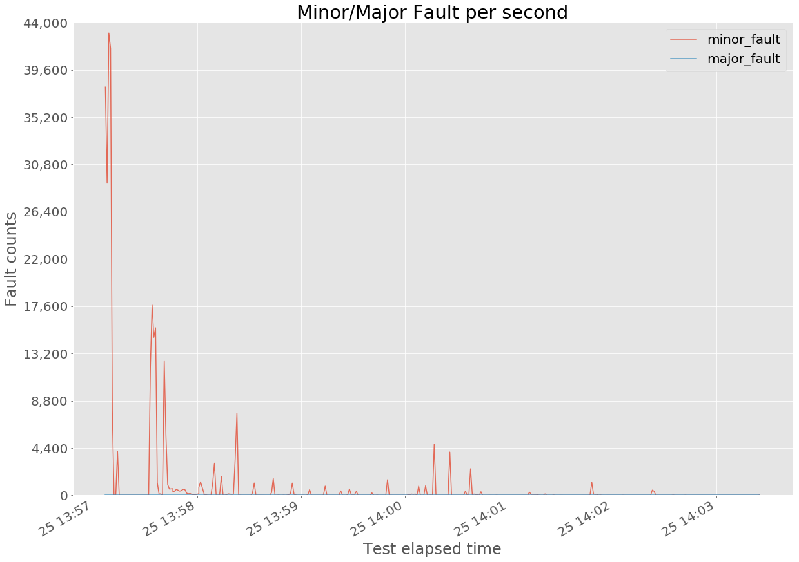
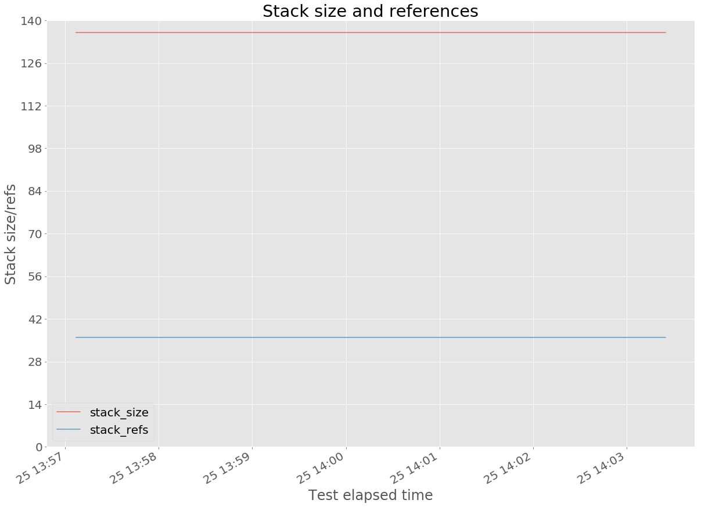

# DESCRIPTION

Generate graphs from `pidstat` command output.


# REQUIREMENT

* Python
    *   Python v3.x
    *   libraries (You can install like this: `pip install numpy pandas matplotlib`)
        *   numpy
        *   pandas
        *   matplotlib


# HOW TO USE

For this script, `pidstat` command **MUST BE** run with `-hurdsw` options like as follows:
``` bash
$ pidstat -hurdsw -p <PID> 1 >pidstat.log
```

And then, generate graphs:
``` bash
$ python3 pidstat_analyzer.py <pidstat.log>
```


# GENERATED GRAPH EXAMPLES

### CPU Usage




### Disk I/O




### MEM Usage




### Context Switch Count




### Page Fault Count




### Stack size


