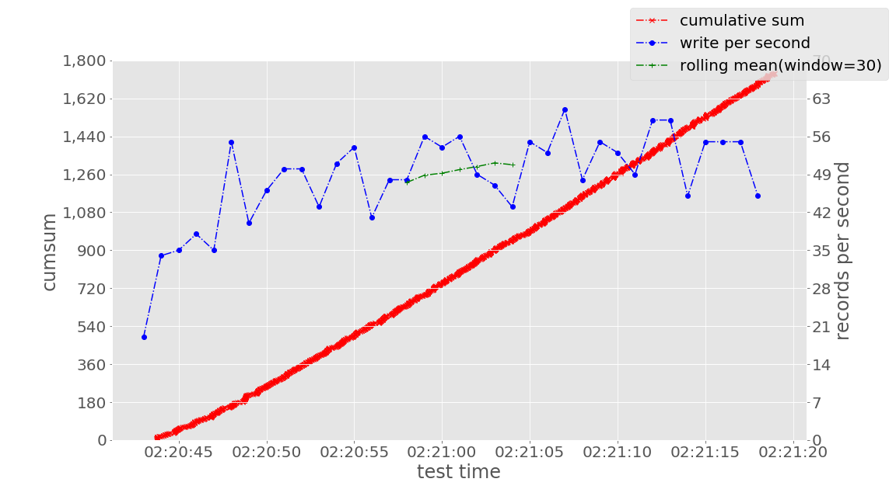

# DESCRIPTION

Generate graphs from a file has single column as datetime like as follows:
```
2019-01-28 02:20:43.745
2019-01-28 02:20:43.770
2019-01-28 02:20:43.771
2019-01-28 02:20:43.755
  :
```

It is OK the following format:
```
2019-01-28T02:20:43.745Z
2019-01-28T02:20:43.770Z
2019-01-28T02:20:43.771Z
2019-01-28T02:20:43.755Z
  :
```


# REQUIREMENT

* Python
    *   Python v3.x
    *   libraries (You can install like this: `pip install numpy pandas matplotlib`)
        *   numpy
        *   pandas
        *   matplotlib


# HOW TO USE

``` bash
$ python3 tps_datetimes.py <log file>
```


# GENERATED GRAPH EXAMPLES


