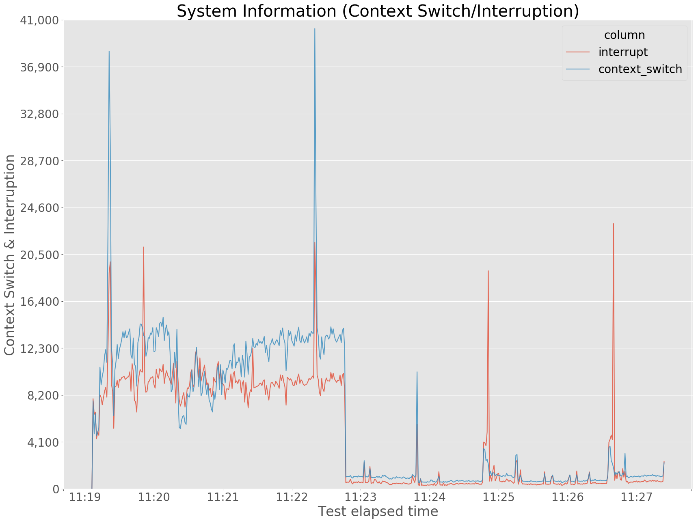

# DESCRIPTION

Generate graphs from `vmstat` command output.


# REQUIREMENT

* Python
    *   Python v3.x
    *   libraries (You can install like this: `pip install numpy pandas matplotlib`)
        *   numpy
        *   pandas
        *   matplotlib


# HOW TO USE

For this script, `vmstat` command **MUST BE** run with `-t` option like as follows:
``` bash
$ vmstat -t 1 >vmstat.log
```

And then, generate graphs:
``` bash
$ python3 vmstat_analyzer.py <vmstat.log>
```


# GENERATED GRAPH EXAMPLES

### CPU Usage


### Disk I/O


### MEM Usage


### Process Info


### Swapping


### System Info


